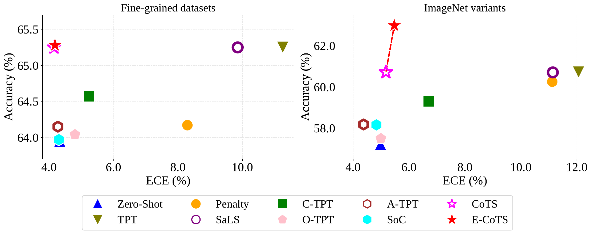

<div align="center">

# 🎯 CoTS

### Calibration-aware instance-level test-time prompt tuning

An evaluation toolkit for studying the accuracy and calibration of CLIP-based
test-time prompt tuning methods.

[Overview](#overview) · [Installation](#installation) · [Data](#data-preparation) · [Quick Start](#quick-start)

</div>

<p align="center">
  
</p>

## Overview

This repository accompanies *Bridging the Confidence Gap: Temperature Scaling
for Calibrating Test-Time Prompt Tuning*.

Test-time prompt tuning (TPT) improves accuracy by adapting prompts to each test
instance, but can make predictions poorly calibrated. CoTS is a simple post-hoc
method that temperature-scales the adapted prediction to reduce its confidence
gap from the well-calibrated zero-shot prediction. It avoids introducing an
additional regularization objective that may trade accuracy for calibration.
E-CoTS further combines CoTS with a weak-strong ensemble over multiple test-time
augmentations, improving accuracy while retaining reliable confidence.

The evaluation pipeline supports five prompt-tuning methods and reports both
top-1 accuracy and Expected Calibration Error (ECE).

| CLI name | Method | Implementation |
|:---:|---|---|
| `tpt` | TPT | `instance_method/tpt.py` |
| `ctpt` | C-TPT | `instance_method/ctpt.py` |
| `otpt` | O-TPT | `instance_method/otpt.py` |
| `atpt` | A-TPT | `instance_method/atpt.py` |
| `soc` | SoC | `instance_method/soc.py` |

Each run evaluates five prediction heads:

| Output label | Description |
|---|---|
| `base` | Base TPT prediction |
| `alpha=1.0` | CoTS calibrated prediction |
| `alpha=0.6` | Fixed-weight CoTS ensemble |
| `alpha=sim` | Similarity-adaptive E-CoTS ensemble |
| `sals` | SaLS prediction |

## Repository Structure

```text
CoTS/
├── instance_tta.py          # Main evaluation entry point
├── run_baseline.sh          # Multi-dataset evaluation script
├── instance_method/         # TPT, C-TPT, O-TPT, A-TPT, and SoC
├── clip/                    # CLIP model implementation
├── data/                    # Dataset, augmentation, and cache utilities
├── utils/                   # Reproducibility and metric helpers
├── coop_weight/             # Optional prompt checkpoints
├── your_cache_path/clip/    # CLIP backbone weights
├── assets/                  # README figure
├── clip_words.csv
└── requirements.txt
```

## Installation

This project requires Python, PyTorch with CUDA support, and a CUDA-capable
GPU. Model weights are managed with [Git LFS](https://git-lfs.com/).

```bash
git lfs install
git clone https://github.com/yuweiliang911/CoTS.git
cd CoTS
git lfs pull

python -m venv .venv
source .venv/bin/activate
pip install -r requirements.txt
```

The included CLIP checkpoints should be located at:

```text
your_cache_path/clip/
├── RN50.pt
└── ViT-B-16.pt
```

They can be obtained in either of the following ways:

- Run `git lfs pull` inside this repository.
- Download the official OpenAI CLIP checkpoints directly:
  [RN50](https://openaipublic.azureedge.net/clip/models/afeb0e10f9e5a86da6080e35cf09123aca3b358a0c3e3b6c78a7b63bc04b6762/RN50.pt) ·
  [ViT-B/16](https://openaipublic.azureedge.net/clip/models/5806e77cd80f8b59890b7e101eabd078d9fb84e6937f9e85e4ecb61988df416f/ViT-B-16.pt)

Place downloaded files in `your_cache_path/clip/` using the filenames shown
above. See the [official CLIP repository](https://github.com/openai/CLIP) for
additional model information.

Optional CoOp prompt checkpoints can be loaded with
`--load /path/to/checkpoint_root`. The directory passed to `--load` must
contain the corresponding `rn50_ep50_16shots/...` or
`vit_b16_ep50_16shots/...` checkpoint tree.

## Data Preparation

Pass the parent dataset directory with `--data`. The expected layout is:

- [CoOp dataset guide](https://github.com/KaiyangZhou/CoOp/blob/main/DATASETS.md):
  download instructions for the fine-grained datasets used by this project.
- [ImageNet](https://image-net.org/download.php)
- [ImageNet-A](https://github.com/hendrycks/natural-adv-examples)
- [ImageNet-R](https://github.com/hendrycks/imagenet-r)
- [ImageNet-Sketch](https://github.com/HaohanWang/ImageNet-Sketch)
- [ImageNetV2](https://github.com/modestyachts/ImageNetV2)

After downloading, arrange the datasets as follows:

```text
/path/to/datasets/
├── imagenet/images/val/
├── imagenet-adversarial/imagenet-a/
├── imagenet-rendition/imagenet-r/
├── imagenet-sketch/images/
├── imagenetv2/imagenetv2-matched-frequency-format-val/
└── few-shot-datasets/
    ├── dtd/
    ├── oxford_flowers/
    ├── caltech-101/
    ├── fgvc_aircraft/
    ├── oxford_pets/
    ├── ucf101/
    ├── stanford_cars/
    ├── eurosat/
    ├── sun397/
    └── food-101/
```

Dataset identifiers accepted by the runner are:

```text
DTD Flower102 Caltech101 Aircraft Pets UCF101 Cars eurosat
SUN397 Food101 I A V R K
```

## Feature Cache

Feature caching is automatic; no extra switch is required. For a run with
seed `0`, backbone `ViT-B/16`, and dataset `DTD`, the runner looks for:

```text
/path/to/feature_cache/CLIP_seed0/ViT-B16/image_DTD.pt
```

In general, the expected path is:

```text
<cache_dir>/CLIP_seed<seed>/<backbone>/image_<dataset>.pt
```

- If the file exists, the runner loads cached image features.
- If it does not exist, the runner loads the original images and applies the
  test-time augmentations directly.

## Quick Start

Run one method on one dataset:

```bash
python instance_tta.py \
  --data /path/to/datasets \
  --cache_dir /path/to/feature_cache \
  --test_sets DTD \
  --algorithm tpt \
  --gpu 0 \
  --arch ViT-B/16 \
  --seed 0
```

Change `--algorithm` to any of `tpt`, `ctpt`, `otpt`, `atpt`, or `soc`.
Use `--arch RN50` to evaluate the RN50 backbone.

To run all datasets from `run_baseline.sh`:

```bash
DATA_ROOT=/path/to/datasets \
CACHE_ROOT=/path/to/feature_cache \
OUTPUT_ROOT=/path/to/outputs \
bash run_baseline.sh 0 tpt none
```

The three positional arguments are:

```text
bash run_baseline.sh <GPU_ID> <METHOD> <CALIBRATION_MODE>
```

`CALIBRATION_MODE` supports `none`,
[`zs-norm`](https://arxiv.org/pdf/2407.13588),
[`penalty`](https://arxiv.org/pdf/2407.13588), and
[`sals`](https://arxiv.org/pdf/2407.13588).

## License

This project is released under the MIT License.
